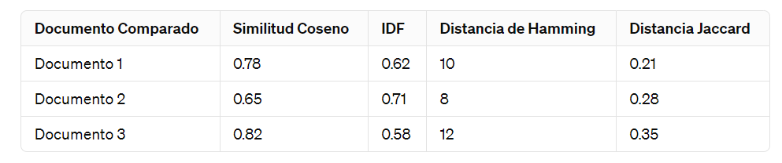
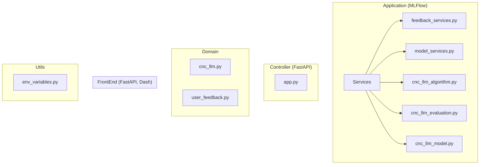
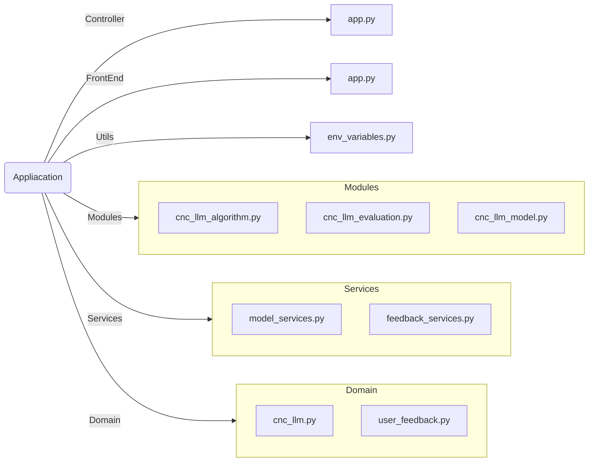
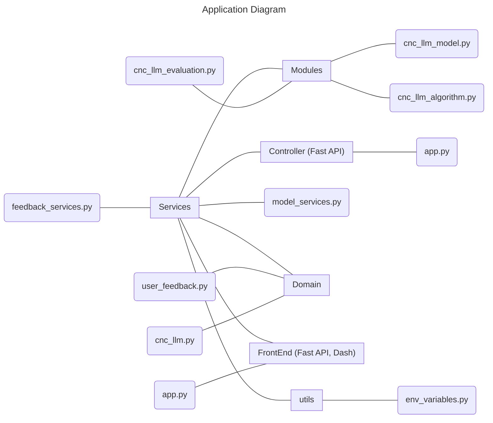
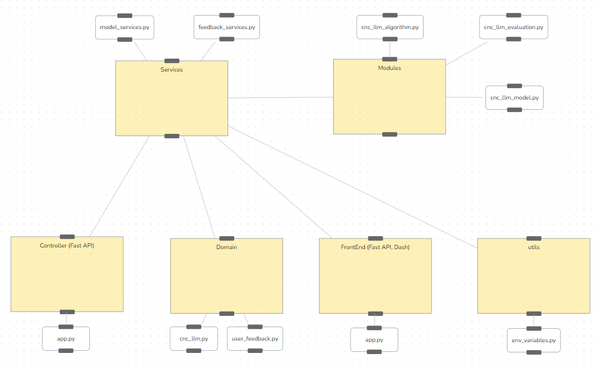

# Project Merlin LLM

$$\color{red}{IMPORTANT}$$
<span style="color:red"> This table is necessary to update </span>

| Version | name | Release Date | Description |
| ------- |---------| ------------ | ----------- |
| 1.0     | Sabin Luja Hernandez |February 19, 2024 | Initial release |
<!-- PULL_REQUESTS_TABLE -->
<!-- cspell:ignore Databricks LANTEK -->
<!-- cspell:enable -->

## Introduction
- [Resumen del documento](https://dev.azure.com/lanteksms/Merlin/_wiki/wikis/Merlin.wiki/1914/BusinessUnderstanding?anchor=b.)
- Que es un CNC
- [Estructura de CNC](https://www.programacioncnc.es/la-estructura-de-un-programa-de-cnc/)
- Tipos de CNC
- Arquitectura del programa 
  - BackEnd
    - LangChain
    - MLFlow
    - DVC
    - Fast API
  - FrontEnd
    - Dash 
    - Fast API
  - MongoDB
  - ElasticSearch
  
- Tipos de algoritmos
- Documentar los distintos lenguajes programación CNC
  - G-code
  - Siemmes
  - Otros lenguajes
- Resumen de los documentos utilizando el LLM codeBERT
- Comparar los documentos con todas las metricas mostradas (en forma de tabla)
- Utilizar el codeBERT para simplificar el CNC inicial para compararlo, para no limpiarlo a mano.

## Resumen del documento
Resumen de las secciones (Análisis de datos - Estructura de un archivo CNC - Procesamiento de los archivos CNC con Python)

- _Análisis de datos:_ Se analizan los archivos CNC proporcionados por Lantek, revelando información clave como la variedad de extensiones, la longitud de los archivos, la frecuencia de los procesadores posteriores y la diversidad de las piezas. Estos hallazgos ayudan a diseñar una estrategia de preprocesamiento y división de datos para evitar el sobreajuste y mejorar el rendimiento del modelo.

- _Estructura de un archivo CNC:_ Los archivos CNC se componen de varios componentes, como coordenadas, comentarios y códigos. La limpieza de los datos implica la eliminación de la información específica de la pieza de los archivos CNC1. Los archivos CNC se dividen en tres partes: encabezado, cuerpo y cola. Entre estas partes, el encabezado y la cola contienen información sobre el procesador posterior, mientras que el cuerpo es específico de la pieza que se construye.

- _Procesamiento de los archivos CNC con Python:_ Se aplican varios pasos de procesamiento a cada parte del archivo CNC, como la eliminación de valores numéricos, caracteres especiales, líneas duplicadas y ejes seguidos de valores numéricos. El objetivo es eliminar el ruido y conservar la información relevante para el procesador posterior.

## Estructura de CNC
Una máquina CNC consta de seis elementos principales:

- Dispositivo de entrada: Es el medio por el cual se introducen las instrucciones en la máquina.

- Unidad de control o controlador: Es el cerebro de la máquina. Interpreta y ejecuta las instrucciones proporcionadas.

- Máquina herramienta: Es la parte de la máquina que realiza el trabajo físico de mecanizado.

- Sistema de accionamiento: Controla el movimiento de la máquina herramienta.

- Dispositivos de realimentación: Estos son necesarios en sistemas con servomotores para proporcionar un control preciso del movimiento.

Un programa CNC se compone de un conjunto de bloques o instrucciones debidamente ordenadas en subrutinas o en el cuerpo del programa, de esta forma se le suministra al CNC toda la información necesaria para el mecanizado de la pieza. La estructura de un programa CNC generalmente consta de tres partes3:

1. Cabecera del programa: Aquí se aloja el nombre o número del programa, la llamada a la herramienta, las rpm de la herramienta, el nombre y corrector de la herramienta.
   
2. Bloques o líneas del programa: Aquí se indican línea a línea a través de la programación CNC los movimientos que se quieren que realice la herramienta: trayectorias, avances, compensaciones de radio, etc.

3. Fin de programa: Se puede definir mediante las funciones M02 ó M30, ambas equivalentes y de uso opcional. Con M02 se para el programa y con M30 se para el programa y se vuelve al inicio del programa.

## Tipos de CNC

Existen varios tipos de máquinas CNC, cada una de las cuales se diferencia en su modo de funcionamiento, herramienta de corte, materiales y número de ejes que pueden cortar simultáneamente. Aquí te presento algunos tipos de máquinas CNC según su función56:

1. Tornos CNC: Utilizados para fabricar objetos cilíndricos y realizar el proceso de producción de piezas de torneado CNC.

2. Fresadoras CNC: Se utilizan para mecanizar superficies planas y formas complejas en una pieza de trabajo.

3. Enrutadores CNC: Se utilizan para mecanizar materiales más blandos y pueden tener una precisión ligeramente menor en comparación con las fresadoras CNC.

4. Cortadoras de plasma CNC: Se utilizan para cortar metales y otros materiales utilizando un chorro de plasma.

5. Rectificadoras CNC: Utilizan una muela abrasiva giratoria para rectificar el material, adoptando la forma deseada.

6. Impresoras 3D CNC: Se utilizan para crear objetos tridimensionales a partir de un modelo digital.


## Estudio de los Datos

### CNC (Control Numerico Computarizado)

1. Definición: Es un sistema que permite el control de la posición de un elemento que está montado en el interior de una máquina o herramienta mediante un software especialmente diseñado para ello.

2. Funcionamiento: El funcionamiento del CNC está basado en el posicionamiento sobre los ejes X, Y, Z. Una misma pieza se puede taladrar, cortar, roscar o desbastar en todos sus planos y formas de manera automática mediante el uso del CNC.

3. Utilidad: La programación CNC sirve para crear instrucciones de programa para que las computadoras puedan controlar una máquina. Esto significa que el CNC está muy involucrado en el proceso de fabricación de cualquier maquinaria, mejorando la automatización y la flexibilidad del sistema.

4. Características: El CNC controla todos los movimientos de una máquina, maneja las coordenadas, la velocidad y algunos parámetros de las maquinarias. Además, personaliza los productos electrónicos para un cliente final y crea herramientas de alta tecnología, como las impresoras en 3D.

### Lenguajes de Programcion de CNC

_G-code:_ Es el lenguaje fundamental utilizado en la programación CNC para definir los movimientos y funciones de la herramienta de corte, abarcando desde movimientos simples hasta operaciones complejas de mecanizado.

_M-code:_ Este tipo de código controla las funciones auxiliares de la máquina CNC, abarcando desde el encendido y apagado del husillo hasta la activación de sistemas de refrigeración y la gestión de cambios de herramientas, lo que garantiza una operación precisa y segura de la máquina.

_Siemens (Sinumerik):_ Sinumerik, desarrollado por Siemens, es un sistema de control numérico avanzado que va más allá de los estándares G y M, ofreciendo funciones específicas y optimizaciones para maximizar la productividad y la calidad del mecanizado en máquinas equipadas con esta tecnología de vanguardia.

_T-code:_ Los códigos T son esenciales en la programación CNC para designar herramientas específicas que se utilizarán en el proceso de mecanizado, lo que permite una gestión eficiente y precisa de las herramientas disponibles en la máquina.

_S-code:_ Estos códigos se utilizan para establecer la velocidad del husillo de la máquina CNC, lo que resulta fundamental para optimizar las condiciones de corte y garantizar una operación eficiente y segura durante el proceso de mecanizado, contribuyendo así a la calidad y la precisión de las piezas producidas.

### Comparacion de CNCs a partir de 4 metricas

En esta seccion compararemos 3 archivos CNC con un 4, en donde utilizaremos 4 metricas para medir su similitud:

1. TF-IDF (Term Frequency-Inverse Document Frequency): Además de calcular solo el IDF, también puedes considerar la frecuencia de términos (TF). TF-IDF es el producto de TF y IDF y puede proporcionar una medida más completa de la importancia de una palabra en un documento en relación con una colección de documentos.

2. Similitud coseno: Esta métrica calcula el coseno del ángulo entre dos vectores de términos (representando los documentos) en un espacio vectorial de términos. Es una medida de similitud ampliamente utilizada para comparar documentos de texto.

3. Distancia de Jaccard: Calcula la similitud entre dos conjuntos de términos dividiendo la intersección de los conjuntos por su unión. Es útil cuando se considera la similitud entre documentos basada en la presencia o ausencia de términos.

4. Distancia de Hamming: Útil cuando se comparan documentos de la misma longitud y se quiere medir la cantidad de caracteres diferentes entre ellos.




Para determinar cuál es el documento más parecido al Documento 4 según las cuatro métricas proporcionadas en la tabla, nos basaremos en sus resultado:

- _Similitud Coseno:_ El Documento 3 tiene el valor más alto de similitud coseno (0.82), lo que indica una mayor similitud con el Documento 4 en términos de sus vectores de características.

- _IDF:_ El Documento 2 tiene el valor más alto de IDF (0.71), lo que sugiere que las palabras en común entre el Documento 4 y el Documento 2 tienen una mayor importancia relativa.

- _Distancia de Hamming:_ El Documento 2 tiene la menor distancia de Hamming (8), lo que indica que tiene la menor cantidad de diferencias en términos de sus secuencias de caracteres.

- _Distancia Jaccard:_ El Documento 1 tiene el valor más bajo de la distancia Jaccard (0.21), lo que sugiere una mayor similitud en términos de las palabras únicas presentes en cada documento.

Si tuviéramos que tomar una decisión basada en una evaluación general, podríamos considerar el Documento 2 como el más parecido al Documento 4. Esto se debe a que tiene valores relativamente buenos en tres de las métricas: similitud coseno, IDF y distancia de Hamming.

### Codigo del ejemplo

```python
from sklearn.feature_extraction.text import TfidfVectorizer
from sklearn.metrics.pairwise import cosine_similarity
import numpy as np

# Definir los documentos
documentos = [
    "G90 G00 X18.78 Y-150.80 F6000.00 M23 M10 ...",  # Documento 1
    "N10 EXTERN MACHINE_ON (INT) N11 EXTERN ...",    # Documento 2
    "O0018 (SHEET Al99 180 X 115 X 0.8 AL99) ...",  # Documento 3
    "% P0185 N2(*MSG, LANTEK HPC PSTHPC03 POST ...", # Documento 4
]

# Función para calcular la distancia de Hamming
def hamming_distance(s1, s2):
    return sum(c1 != c2 for c1, c2 in zip(s1, s2))

# Tokenizar los documentos
vectorizer = TfidfVectorizer()
X = vectorizer.fit_transform(documentos)

# Calcular IDF
idf_values = np.asarray(vectorizer.idf_)
idf_similarity = 1 / (1 + idf_values)

# Calcular similitud coseno
cosine_sim = cosine_similarity(X, X)

# Calcular distancia de Hamming
hamming_sim = np.zeros((len(documentos), len(documentos)))
for i, doc1 in enumerate(documentos):
    for j, doc2 in enumerate(documentos):
        hamming_sim[i, j] = hamming_distance(doc1, doc2)

# Función para calcular la distancia Jaccard entre dos conjuntos
def jaccard_distance(set1, set2):
    intersection = len(set1.intersection(set2))
    union = len(set1.union(set2))
    return 1 - intersection / union if union else 0

# Tokenizar los documentos en conjuntos de palabras únicas
tokenized_docs = [set(doc.split()) for doc in documentos]

# Calcular la distancia Jaccard entre cada par de documentos
jaccard_sim = np.zeros((len(documentos), len(documentos)))
for i, set1 in enumerate(tokenized_docs):
    for j, set2 in enumerate(tokenized_docs):
        jaccard_sim[i, j] = jaccard_distance(set1, set2)

# Imprimir los resultados
print("\nIDF:")
print(idf_similarity)
print("Similitud Coseno:")
print(cosine_sim)
print("\nDistancia de Hamming:")
print(hamming_sim)
print("\nDistancia Jaccard:")
print(jaccard_sim)
```

## Resumen de los documentos utilizando el LLM codeBERT

Para generar un resumen de los documentos utilizando un modelo pre-entrenado como BERT, primero necesitaríamos dividir los documentos en oraciones y luego utilizar el modelo para identificar las oraciones más relevantes que resuman el contenido principal del documento. Aquí tienes un ejemplo de cómo podríamos hacerlo en Python utilizando la biblioteca Transformers de Hugging Face:

```python
from transformers import BertTokenizer, BertForMaskedLM
import torch

# Cargar el modelo y el tokenizador pre-entrenado
model_name = "bert-base-uncased"
tokenizer = BertTokenizer.from_pretrained(model_name)
model = BertForMaskedLM.from_pretrained(model_name)

# Definir los documentos
documentos = [
    "G90 G00 X18.78 Y-150.80 F6000.00 M23 M10 ...",  # Documento 1
    "N10 EXTERN MACHINE_ON (INT) N11 EXTERN ...",    # Documento 2
    "O0018 (SHEET Al99 180 X 115 X 0.8 AL99) ...",  # Documento 3
    "% P0185 N2(*MSG, LANTEK HPC PSTHPC03 POST ...", # Documento 4
]

# Generar resúmenes para cada documento
for i, doc in enumerate(documentos):
    # Tokenizar el documento
    inputs = tokenizer(doc, return_tensors="pt", max_length=512, truncation=True)

    # Generar resumen utilizando el modelo BERT
    outputs = model(**inputs)
    predictions = outputs.logits.argmax(-1)
    summary = tokenizer.decode(predictions[0], skip_special_tokens=True)

    # Imprimir el resumen generado
    print(f"Resumen del Documento {i+1}:")
    print(summary)
    print()
```

Este código carga el modelo BERT pre-entrenado y el tokenizador correspondiente, luego genera un resumen para cada documento utilizando el modelo.

## Tipos de Algoritmos controlados en CNC

Los algoritmos utilizados en el control numérico por computadora (CNC) varían según el fabricante y el tipo de máquina CNC. Aquí hay una descripción general de algunos tipos comunes de algoritmos utilizados en CNC:

1. _Algoritmos de interpolación:_ Estos algoritmos calculan trayectorias suaves y precisas para mover la máquina de corte a lo largo de una ruta específica. Los tipos comunes de interpolación incluyen interpolación lineal, interpolación circular (G02 y G03 en G-code), interpolación helicoidal y otros.

2. _Algoritmos de compensación de herramientas:_ Estos algoritmos ajustan las trayectorias de la herramienta para tener en cuenta el radio de la herramienta de corte. Por ejemplo, la compensación de herramientas puede corregir las trayectorias para que la herramienta corte exactamente donde se espera, teniendo en cuenta su tamaño y forma.

3. _Algoritmos de planificación de trayectorias:_ Estos algoritmos determinan la mejor secuencia de movimientos de la herramienta para minimizar el tiempo de mecanizado y evitar colisiones con la pieza de trabajo, la máquina u otras partes del entorno.

4. _Algoritmos de control de velocidad de avance:_ Estos algoritmos ajustan la velocidad de avance de la herramienta de corte durante el mecanizado para mantener la calidad de la superficie, evitar la vibración y optimizar la velocidad de producción.

5. _Algoritmos de detección de colisiones:_ Estos algoritmos analizan las trayectorias de la herramienta y detectan posibles colisiones entre la herramienta, la pieza de trabajo y otras partes de la máquina CNC. Esto ayuda a prevenir daños costosos y garantizar la seguridad del proceso de mecanizado.

6. _Algoritmos de compensación de errores de máquina:_ Estos algoritmos ajustan automáticamente las trayectorias de la herramienta para compensar errores de geometría, desalineación o desgaste en la máquina CNC.


## Propuesta de Arquitectura del Proyecto

- Application (MLFlow)
  - Services
    - feedback_services.py
    - model_services.py
   - cnc_llm_algorithm.py
   - cnc_llm_evaluation.py
   - cnc_llm_model.py
  
- Controller (FastAPI)
  - app.py
  
- Domain
  - cnc_llm.py
  - user_feedback.py
  
- FrontEnd (FastAPI, Dash)
  - app.py
  
- Utils
  - env_variables.py

- MLFlow Server (registrar expermientos de ML)
- MongoDB Server (guardar los datos)
- ElasticSearch Server (base de datos vectorial, guarda el vector tokens)
- Docker Composer Conf File

### Primer modelo de diagrama



### Segundo modelo de diagrama


### Tercer modelo de diagrama



### Ultimo modelo de diagrama



## BaseEstimator

BaseEstimator es una clase base (base class) proporcionada por scikit-learn que sirve como la base para todos los estimadores de aprendizaje automático en esta biblioteca. Los estimadores son objetos en scikit-learn que implementan métodos para ajustar (fit) un modelo a los datos y hacer predicciones sobre nuevos datos.

### Puntos Importante

Algunos puntos clave para entender sobre BaseEstimator:

1. Interfaz Consistente: Una de las características principales de scikit-learn es su consistencia en la interfaz de programación de aplicaciones (API). Todos los estimadores de scikit-learn, independientemente de su complejidad o tipo, siguen una interfaz coherente. Esto facilita el intercambio de estimadores y la construcción de tuberías (pipelines) de aprendizaje automático.

2. Métodos Obligatorios: La clase BaseEstimator proporciona métodos que deben ser implementados por cualquier estimador personalizado que se cree en scikit-learn. Estos métodos incluyen fit() para ajustar el modelo a los datos de entrenamiento y predict() para hacer predicciones sobre nuevos datos. Otros métodos comunes incluyen score() para evaluar el rendimiento del modelo y get_params() para obtener los parámetros del estimador.

3. Compatibilidad con Pipelines: Al heredar de BaseEstimator, los estimadores personalizados se vuelven compatibles con la construcción de tuberías en scikit-learn. Las tuberías permiten encadenar varios pasos de procesamiento de datos y estimación en un solo objeto, lo que facilita la implementación de flujos de trabajo de aprendizaje automático más complejos.

4. Flexibilidad y Extensibilidad: La clase BaseEstimator permite a los desarrolladores crear sus propios estimadores personalizados con flexibilidad y extensibilidad. Esto significa que puedes crear y ajustar modelos que se adapten específicamente a tus necesidades y datos.

### Ejemplo de BaseEstimator

Ejemplo básico de cómo se puede usar BaseEstimator para crear un estimador personalizado en scikit-learn:

``` python
from sklearn.base import BaseEstimator
import numpy as np

class CustomEstimator(BaseEstimator):
    def __init__(self, parameter1=1, parameter2=2):
        self.parameter1 = parameter1
        self.parameter2 = parameter2
        self.coefficients_ = None

    def fit(self, X, y=None):
        # Aquí puedes implementar el ajuste del modelo, por ejemplo, regresión lineal simple
        # Supongamos que X es una matriz de características y y son las etiquetas/targets
        X = np.array(X)
        y = np.array(y)
        
        # Ajustar los coeficientes del modelo
        self.coefficients_ = np.linalg.inv(X.T @ X) @ X.T @ y
        
        return self

    def predict(self, X):
        # Implementación de la predicción aquí
        if self.coefficients_ is None:
            raise ValueError("El modelo no ha sido ajustado todavía.")
        
        X = np.array(X)
        predictions = X @ self.coefficients_
        return predictions

    def score(self, X, y):
        # Calcular la puntuación de rendimiento del modelo
        # En este caso, simplemente calculamos la suma de residuos cuadrados
        predictions = self.predict(X)
        residuals = y - predictions
        rss = np.sum(residuals ** 2)
        return rss

    def get_params(self, deep=True):
        # Obtener los parámetros del estimador
        return {"parameter1": self.parameter1, "parameter2": self.parameter2}

    def set_params(self, **parameters):
        # Establecer los parámetros del estimador
        for parameter, value in parameters.items():
            setattr(self, parameter, value)
        return self

```